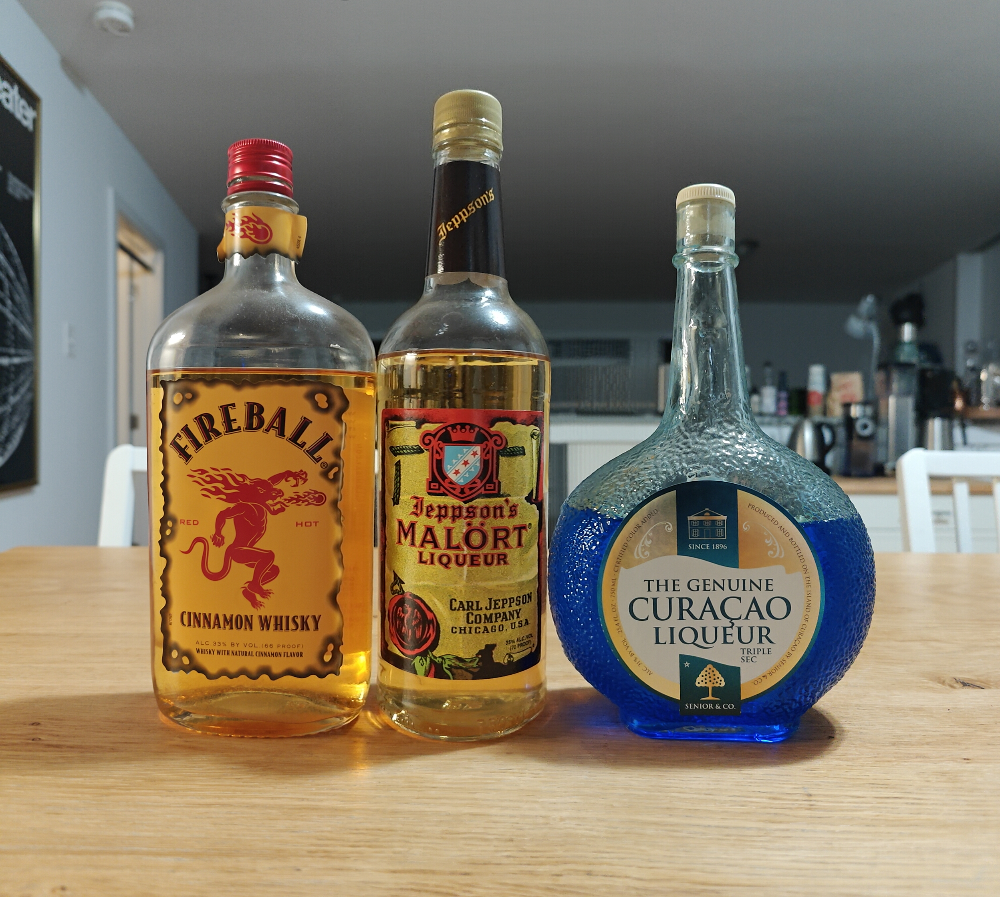

# Home Bar Inventory

A complete inventory of my home bar collection, organized by spirit and mixer type.

## Spirits Collection

### Image 1: Tequilas and Rums

1. **Smokey Something** - It's an agave spirit of some kind
2. **Casa Noble** - Tequila Reposado
3. **Espolón Tequila Blanco** - A crisp, agave-forward tequila perfect for cocktails. *LOW*
4. **El Silencio Mezcal** - A smoky, complex mezcal with earthy undertones.
5. **Flor de Caña** - A smooth, carbon-neutral certified aged rum from Nicaragua.
6. **Tennessee Hills Coffee Rum** - A Tennessee coffee rum.
7. **Kirkland Spiced Rum** - A budget-friendly spiced rum with vanilla and cinnamon notes.
8. **Cruzan Black Strap Rum** - A dark, molasses-rich rum perfect for tiki drinks.
9. **Courvoisier VS Cognac** - A classic cognac with fruity notes and mild oak influence.

### Image 6: Gins and Whiskies

1. **Stray Dog Wild Gin** - A small-batch Greek gin with foraged Mediterranean botanicals.
2. **Bombay Sapphire** - A classic London Dry Gin with a balanced blend of 10 botanicals.
3. **Ransom Old Tom Gin** - A historically-inspired barrel-aged gin with a malty sweetness.
4. **Trader Joe's Art of the Still Organic Gin** - An affordable organic gin with traditional botanicals.
5. **Monkey Shoulder** - A blended malt Scotch whisky designed specifically for mixing.
6. **SE Callahan's Bourbon** - A small batch bourbon from Tennessee.
7. **Rittenhouse Rye** - A bottled-in-bond straight rye whiskey, perfect for classic cocktails.
8. **Drambuie** - A Scotch whisky liqueur flavored with honey, herbs and spices.

### Image 2: Liqueurs and Amari

1. **Le Grand Chartruese** - Amazing, mostly used like a bitter. *LOW*
2. **Green Chartreuse** - A complex herbal liqueur made by French monks with a secret recipe of 130 herbs. *LOW*
3. **Ver** - A modern take on traditional Italian amaro with complex botanical notes.
4. **Izarra Green** - A Basque liqueur made with herbs and honey, available in green and yellow varieties.
5. **Enrico Toro Centerbe** - An intensely herbal Italian liqueur with a bright green color.
6. **Boomsma Cloosterbitter** - A Dutch herbal bitter with a balanced sweetness.
7. **Genepy des Chamonix** - A traditional Alpine herbal liqueur similar to Chartreuse.
8. **Faccia Brutto** - A craft Italian-style bitter from Brooklyn with complex botanical notes.
9. **Izarra (Yellow)** - The yellow variant of the Basque herbal liqueur, sweeter than its green counterpart.
10. **Strega** - An Italian herbal liqueur with saffron notes and a golden color.
11. **Crème de Violette** - A floral violet liqueur essential for Aviation cocktails.

### Image 3: Vermouths and Fortified Wines

1. **Martini & Rossi Extra Dry** - A classic dry vermouth with herbal notes and a crisp finish.
2. **Antica Formula** - A premium sweet vermouth with complex vanilla and herbal notes.
3. **Berto Rosso** - A Piedmontese sweet vermouth with balanced bitterness and aromatics.
4. **Berto Bianco** - A white vermouth with elegant floral and citrus notes.
5. **Tattersall Manhattan** - A ready-to-drink Manhattan mixing whiskey, sweet vermouth, and bitters.
6. **Chaucer's Mead** - A traditional honey wine with floral sweetness.

### Image 4: Bitters Collection

1. **Bittercube (Various)** - Craft bitters in flavors like Cherry Bark Vanilla, Trinity, Root Beer, Blackstrap, and Bolivar.
2. **Peychaud's Aromatic Cocktail Bitters** - A classic New Orleans bitter essential for Sazeracs.
3. **Trader Joe's Classic Bitters** - A traditional aromatic bitter with balanced spice notes.
4. **Fee Brothers Cranberry Bitters** - Tart cranberry flavor to brighten cocktails.
5. **Fee Brothers Grapefruit Bitters** - Citrusy bitters perfect for gin and tequila drinks.
6. **Fee Brothers Orange Bitters** - Classic orange bitters to complement whiskey and gin cocktails.
7. **Fee Brothers Cherry Bitters** - Adds cherry notes to Manhattans and other classics.
8. **Angostura Cocoa Bitters** - Never actually used this, imagine it tastes like cocoa.
9. **Angostura Aromatic Bitters** - The essential aromatic bitters found in countless classic cocktails.

### Image 5: European Spirits and Liqueurs

1. **Helbing Aquavit** - German aquavit, bitter, good. *LOW*
2. **Helbing Kümmel** - A German caraway seed liqueur with notes of cumin and fennel. *LOW*
3. **Hardy Organic Cognac** - A smooth, organic French brandy with sustainable production methods. 
4. **St. George Spiced Pear Liquer** - Haven't had it. Pear?
5. **Aperol** - An Italian aperitif with notes of bitter orange and herbs.
6. **Cointreau** - A premium orange liqueur essential for margaritas and cosmopolitans.
7. **St. George Absinthe** - Absinthe.
8. **Vieux Carré** - French Absinthe.
9. **Amaro Montenegro** - An Italian herbal amaro with a balanced sweet-bitter profile.
10. **Fernet-Branca** - An intensely bitter Italian amaro with medicinal notes and a cult following.
11. **R. Jelinek Fernet** - Less intense bitter fernet.
12. **Lavender Brandy** - Haven't had it. Lavender Brandy?
13. **Kahlúa** - A coffee liqueur from Mexico used in White Russians and Espresso Martinis. *LOW*

### Image 7: Mixers and Syrups

1. **Luxardo Maraschino Cherries** - Premium cocktail cherries that are the gold standard for garnishing.
2. **Rose's Grenadine** - A pomegranate-flavored syrup for adding sweetness and color to cocktails.
3. **Wholesome Organic Raw Blue Agave** - A natural sweetener alternative to simple syrup.
4. **Dole Pineapple Juice** - 100% pineapple juice perfect for tropical cocktails.
5. **Pure Coconut Cream** - Rich coconut cream essential for Piña Coladas and tropical drinks.
6. **Stirrings Simple Syrup** - A ready-made bar syrup for sweetening cocktails.

### Image 8: Flavored Spirits and Liqueurs

1. **Fireball Cinnamon Whisky** - A popular cinnamon-flavored whisky with a spicy-sweet kick.
2. **Jeppson's Malört** - A notorious Chicago wormwood liqueur known for its challenging bitter flavor.
3. **Curaçao Liqueur** - A blue citrus liqueur made from the dried peels of the laraha fruit.

### Image 9: Italian and Specialty Liqueurs

1. **Cherry Orchard Maraschino** - A maraschino liqueur with authentic cherry flavor.
2. **Tempus Fugit Crème de Cacao** - A premium chocolate liqueur with natural vanilla notes.
3. **Italicus Rosolio di Bergamotto** - A bergamot-infused Italian aperitivo reviving a traditional recipe.
4. **Amaretto** - An almond-flavored Italian liqueur with sweet, nutty notes.
5. **Pronto Amaro** - A modern Italian bitter aperitivo with citrus and herbal notes.
6. **Campari** - The classic Italian red bitter aperitif essential for Negronis.
7. **Bonal Gentiane-Quina** - A French aperitif wine infused with gentian, quinine and herbs. *LOW*
8. **St-Germain** - A French elderflower liqueur with delicate floral notes.
9. **Asbach Uralt** - A German apple brandy with bold, woody character.